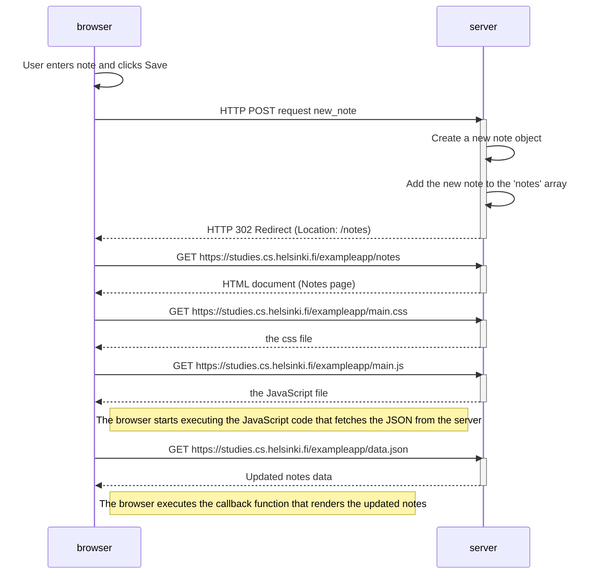

```mermaid
sequenceDiagram
    participant browser
    participant server
    

   %% Creating a New Note
    browser->>browser: User enters note and clicks Save
    browser->>server: HTTP POST request new_note
    activate server
    server->>server: Create a new note object
    server->>server: Add the new note to the 'notes' array
    server-->>browser: HTTP 302 Redirect (Location: /notes)
    deactivate server

   %% Reloading Notes Page
    browser->>server: GET https://studies.cs.helsinki.fi/exampleapp/notes
    activate server
    server-->>browser: HTML document (Notes page)
    deactivate server

    browser->>server: GET https://studies.cs.helsinki.fi/exampleapp/main.css
    activate server
    server-->>browser: the css file
    deactivate server

    browser->>server: GET https://studies.cs.helsinki.fi/exampleapp/main.js
    activate server
    server-->>browser: the JavaScript file
    deactivate server

    Note right of browser: The browser starts executing the JavaScript code that fetches the JSON from the server

    browser->>server: GET https://studies.cs.helsinki.fi/exampleapp/data.json
    activate server
    server-->>browser: Updated notes data
    deactivate server

    Note right of browser: The browser executes the callback function that renders the updated notes
```
