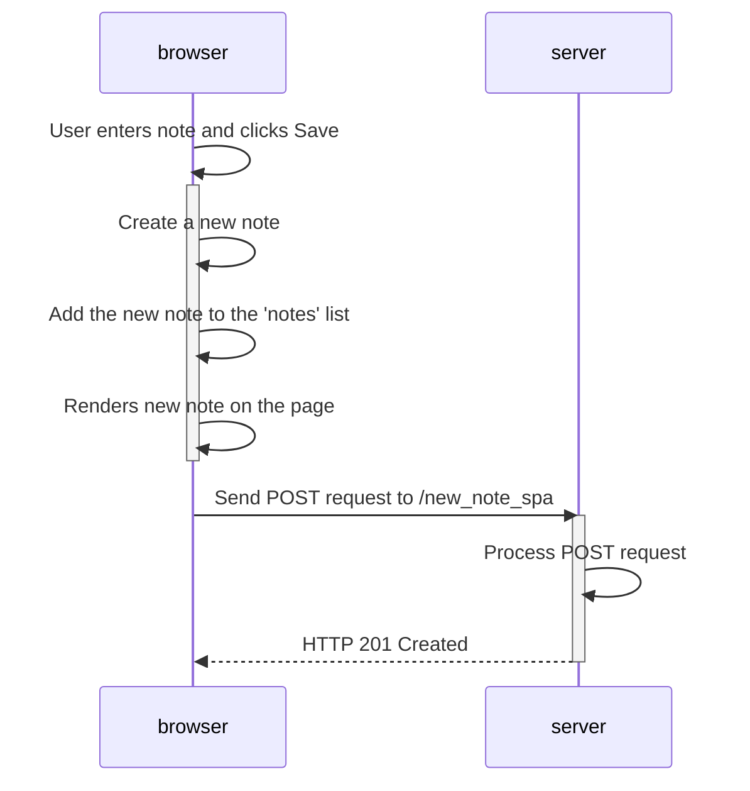

```mermaid
  sequenceDiagram
    participant browser
    participant server
    

    %% User Creates a New Note
    browser->>browser: User enters note and clicks Save
    activate browser
    browser->>browser: Create a new note 
    browser->>browser: Add the new note to the 'notes' list
    browser->>browser: Renders new note on the page
    deactivate browser

    %% Sending Data to Server via AJAX
    browser->>server: Send POST request to /new_note_spa
    activate server
    server->>server: Process POST request
    server-->>browser: HTTP 201 Created
    deactivate server
    
```
